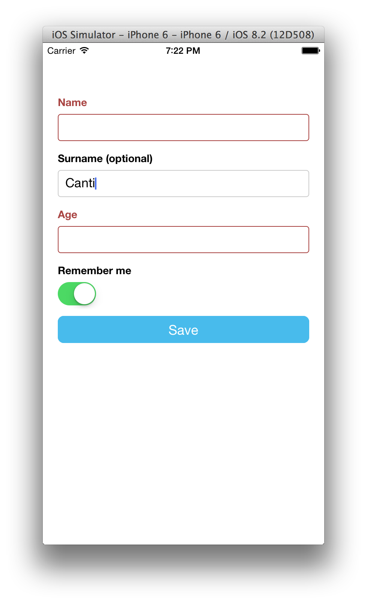

# Setup

```
npm install tcomb-form-native
```

# Domain Driven Forms

The [tcomb library](https://github.com/gcanti/tcomb) provides a concise but expressive way to define domain models in JavaScript.

The [tcomb-validation library](https://github.com/gcanti/tcomb-validation) builds on tcomb, providing validation functions for tcomb domain models.

This library builds on those two and on the awesome react-native.

# Benefits

With tcomb-form-native you simply call `<Form type={Model} />` to generate a form based on that domain model. What does this get you?

1. Write a lot less code
2. Usability and accessibility for free (automatic labels, inline validation, etc)
3. No need to update forms when domain model changes


# Example

```js
// index.ios.js

'use strict';

var React = require('react-native');
var t = require('tcomb-form-native');
var {
  AppRegistry,
  StyleSheet,
  Text,
  View,
  TouchableHighlight,
} = React;

var Form = t.form.Form;

var Person = t.struct({
  name: t.Str,              // a required string
  surname: t.maybe(t.Str),  // an optional string
  age: t.Num,               // a required number
  rememberMe: t.Bool        // a boolean
});

var options = {}; // optional rendering options...

var AwesomeProject = React.createClass({

  onPress: function () {
    var value = this.refs.form.getValue();
    if (value) {
      console.log(value);
    }
  },

  render: function() {
    return (
      <View style={styles.container}>
        <Form
          ref="form"
          type={Person}
          options={options}
        />
        <TouchableHighlight style={styles.button} onPress={this.onPress} underlayColor='#99d9f4'>
          <Text style={styles.buttonText}>Save</Text>
        </TouchableHighlight>
      </View>
    );
  }
});

var styles = StyleSheet.create({
  container: {
    justifyContent: 'center',
    marginTop: 50,
    padding: 20,
    backgroundColor: '#ffffff',
  },
  title: {
    fontSize: 30,
    alignSelf: 'center',
    marginBottom: 30
  },
  buttonText: {
    fontSize: 18,
    color: 'white',
    alignSelf: 'center'
  },
  button: {
    height: 36,
    backgroundColor: '#48BBEC',
    borderColor: '#48BBEC',
    borderWidth: 1,
    borderRadius: 8,
    marginBottom: 10,
    alignSelf: 'stretch',
    justifyContent: 'center'
  }
});

AppRegistry.registerComponent('AwesomeProject', () => AwesomeProject);
```

### Result:

(Labels are auto generated)


### Result after a validation error:



# Docs

## Types

### Optional field

To create an optional field wrap the field type with `t.maybe`:

```js
var Person = t.struct({
  name: t.Str,
  surname: t.Str,
  email: t.maybe(t.Str) // an optional string
});
```

The label postfix ` (optional)` is automatically generated.

### Numeric field

To create a numeric field use `t.Num`:

```js
var Person = t.struct({
  name: t.Str,
  surname: t.Str,
  email: t.maybe(t.Str),
  age: t.Num // a numeric field
});
```

tcomb-form-native converts numbers to / from strings.

### Boolean field

To create a boolean field use `t.Bool`:

```js
var Person = t.struct({
  name: t.Str,
  surname: t.Str,
  email: t.maybe(t.Str),
  age: t.Num,
  rememberMe: t.Bool // a boolean field
});
```

Booleans are displayed as switches.

### Enum field

To create an enum field use `t.enums`:

```js
var Gender = t.enums({
  M: 'Male',
  F: 'Female'
});

var Person = t.struct({
  name: t.Str,
  surname: t.Str,
  email: t.maybe(t.Str),
  age: t.Num,
  rememberMe: t.Bool,
  gender: Gender // enums field
});
```

enums are displayed as `PickerIOS`.

### Subtypes

A *predicate* is a function with the following signature:

```
(x: any) => boolean
```

You can refine a type with `t.subtype(type, predicate)`:

```js
// a type representing positive numbers
var Positive = t.subtype(t.Num, function (n) {
  return n >= 0;
});

var Person = t.struct({
  name: t.Str,
  surname: t.Str,
  email: t.maybe(t.Str),
  age: Positive, // refinement
  rememberMe: t.Bool,
  gender: Gender
});
```

Subtypes allow you to express any custom validation with a simple predicate.

## Options

To customize the form look and feel passing a `options` prop to the `Form` component:

```js
<Form type={Model} options={options} />
```

### Fieldset options

#### Automatically generated placeholders

Pass the option `auto: 'placeholders'` to generate default placeholders:

```js
var options = {
  auto: 'placeholders'
};

<Form type={Person} options={options} />
```


Or `auto: 'none'` if you don't want neither labels nor placeholders.

```js
var options = {
  auto: 'none'
};
```

#### Fields order

You can order the fields with the `order` option:

```js
var options = {
  order: ['name', 'surname', 'rememberMe', 'gender', 'age', 'email']
};
```

#### Default values

You can set the default values passing a `value` prop to the `Form` component:

```js
var value = {
  name: 'Giulio',
  surname: 'Canti',
  age: 41,
  gender: 'M'
};

<Form type={Model} value={value} />
```

#### Fields configuration

You can configure each field with the `fields` option:

```js
var options = {
  fields: {
    name: {
      // name field configuration here..
    },
    surname: {
      // surname field configuration here..
    }
  }
});
```

# License

MIT
